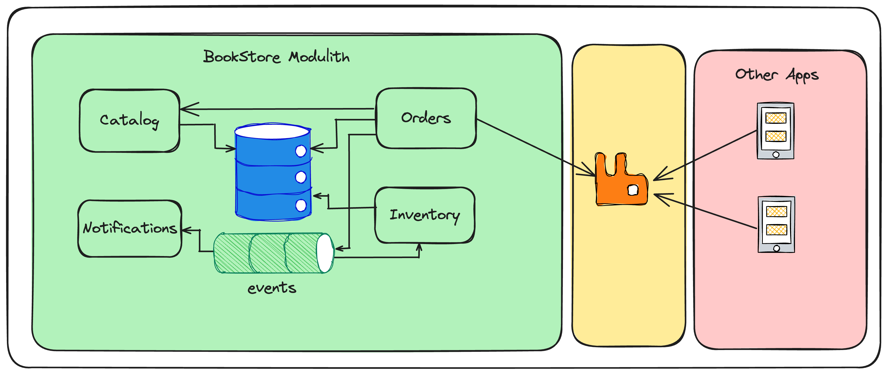

# spring-modular-monolith
An e-commerce application following Modular Monolith architecture using [Spring Modulith](https://spring.io/projects/spring-modulith).
The goal of this application is to demonstrate various features of Spring Modulith with a practical application.



This application follows modular monolith architecture with the following modules:

* **Common:** This module contains the code that is shared by all modules.
* **Catalog:** This module manages the catalog of products and store data in `catalog` schema.
* **Customers:** This module implements the customer management and store data in `customers` schema.
* **Orders:** This module implements the order management and store the data in `orders` schema.
* **Inventory:** This module implements the inventory management and store the data in `inventory` schema.
* **Notifications:** This module handles the events published by other modules and sends notifications to the interested parties.

**Goals:**
* Implement each module as independently as possible.
* Prefer event driven communication over direct module dependency wherever applicable.
* Store data managed by each module in an isolated manner by using different schema or database.
* Each module should be testable by loading only module-specific components.

**Module communication:**

* **Common** module is an OPEN module that can be used by other modules.
* **Orders** module invokes the **Catalog** module public API to validate the order details
* When an Order is successfully created, **Orders** module publishes **"OrderCreatedEvent"**
* The **"OrderCreatedEvent"** will also be published to external broker like RabbitMQ. Other applications may consume and process those events.
* **Inventory** module consumes "OrderCreatedEvent" and updates the stock level for the products.
* **Notifications** module consumes "OrderCreatedEvent" and sends order confirmation email to the customer.

## Prerequisites
* JDK 21
* Docker and Docker Compose
* Your favourite IDE (Recommended: [IntelliJ IDEA](https://www.jetbrains.com/idea/))

Install JDK, Gradle using [SDKMAN](https://sdkman.io/)

```shell
$ curl -s "https://get.sdkman.io" | bash
$ source "$HOME/.sdkman/bin/sdkman-init.sh"
$ sdk install java 21.0.1-tem
$ sdk install gradle
$ sdk install maven
```

Task is a task runner that we can use to run any arbitrary commands in easier way.

```shell
$ brew install go-task
(or)
$ go install github.com/go-task/task/v3/cmd/task@latest
```

Verify the prerequisites

```shell
$ java -version
$ docker info
$ docker compose version
$ task --version
```

## Using `task` to perform various tasks:

The default `Taskfile.yml` is configured to use Gradle.
Another `Taskfile.maven.yml` is also created with Maven configuration.

If you want to use Maven instead of Gradle, then add `-t Taskfile.maven.yml` for the `task` commands.

For example: 

```shell
$ task test` // uses Gradle
$ task -t Taskfile.maven.yml test` //uses Maven
```

```shell
# Run tests
$ task test

# Automatically format code using spotless-maven-plugin
$ task format

# Build docker image
$ task build_image

# Run application in docker container
$ task start
$ task stop
$ task restart
```

## Deploying on k8s cluster
* [Install kubectl](https://kubernetes.io/docs/tasks/tools/)
* [Install kind](https://kind.sigs.k8s.io/docs/user/quick-start/)

```shell
$ brew install kubectl
$ brew install kind
```

Create KinD cluster and deploy app.

```shell
# Create KinD cluster
$ task kind_create

# deploy app to kind cluster 
$ task k8s_deploy

# undeploy app
$ task k8s_undeploy

# Destroy KinD cluster
$ task kind_destroy
```
